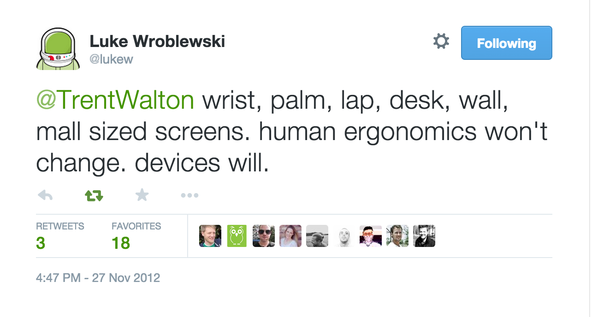

# ergonomic-viewport
[![NPM version][npm-image]][npm-url]
[![build status][travis-image]][travis-url]
[![Test coverage][coveralls-image]][coveralls-url]
[![Downloads][downloads-image]][downloads-url]
[![js-standard-style][standard-image]][standard-url]

Get the current ergonomic viewport.

[](https://twitter.com/lukew/status/273453112902172672)

## Installation
```bash
$ npm install ergonomic-viewport
```

## Usage
```js
const viewport = require('ergonomic-viewport')

viewport()
// => 'lap'
```

## API
### viewport([number])
Get the ergonomic viewport. Response is one of `wrist`, `palm`, `lap`, `desk`,
and `wall`. Suggestions for a `mall` breakpoint value are welcome.

## Why?
Defining sizes in terms of known devices causes issues in the future (phablet
size, anyone?) so instead it's safer to base names on human ergonomics.

## See Also
- [active development on Categorizr has come to an end](http://brettjankord.com/2013/01/10/active-development-on-categorizr-has-come-to-an-end/)
- [unified device static](http://static.lukew.com/unified_device_design.png)
- [screensiz.es](http://screensiz.es/)
- [ergonomic breakpoint](https://www.npmjs.com/package/ergonomic-breakpoint) - ergonomic CSS media queries

## License
[MIT](https://tldrlegal.com/license/mit-license)

[npm-image]: https://img.shields.io/npm/v/ergonomic-viewport.svg?style=flat-square
[npm-url]: https://npmjs.org/package/ergonomic-viewport
[travis-image]: https://img.shields.io/travis/yoshuawuyts/ergonomic-viewport/master.svg?style=flat-square
[travis-url]: https://travis-ci.org/yoshuawuyts/ergonomic-viewport
[coveralls-image]: https://img.shields.io/coveralls/yoshuawuyts/ergonomic-viewport.svg?style=flat-square
[coveralls-url]: https://coveralls.io/r/yoshuawuyts/ergonomic-viewport?branch=master
[downloads-image]: http://img.shields.io/npm/dm/ergonomic-viewport.svg?style=flat-square
[downloads-url]: https://npmjs.org/package/ergonomic-viewport
[standard-image]: https://img.shields.io/badge/code%20style-standard-brightgreen.svg?style=flat-square
[standard-url]: https://github.com/feross/standard
